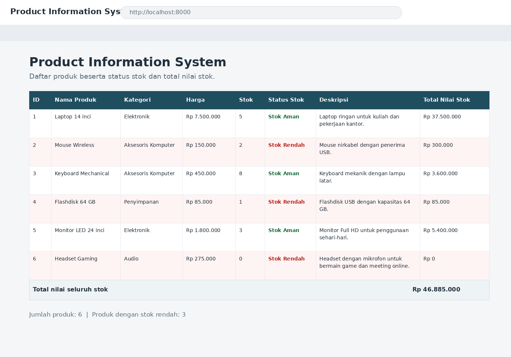

# Mini Project 1 - Product Information System

Tugas Pemrograman Web (PHP Pertemuan 2). Sistem sederhana untuk menampilkan data produk toko perlengkapan komputer, dibuat dengan PHP native dan array, tanpa database dan tanpa framework. Kodenya dibagi menjadi 3 layer: Data Layer, Processing Layer, dan Presentation Layer.

# Mini Project 1

## Identitas
- **Nama:** Anggraini Reka Kalsum
- **NIM:** 250180025
- **Program Studi:** Sistem Informasi
- **Universitas:** Universitas Malikussaleh
- **Kelas:** A1

## Deskripsi Project
Mini Project 1 merupakan tugas mata kuliah Pemrograman Web.

Project ini dibuat sebagai bagian dari tugas pembelajaran dan dikumpulkan melalui GitHub.

## Isi Project
Project ini berisi file-file yang diperlukan untuk menyelesaikan Mini Project 1.

## Author
Anggraini Reka Kalsum
## Isi file

- `products.php` - Data Layer. Array berisi 6 produk (id, nama, kategori, harga, stok, deskripsi).
- `functions.php` - Processing Layer. Berisi `hitungTotalNilaiStok()`, `cekStatusStok()`, dan `formatRupiah()`.
- `index.php` - Presentation Layer. Memanggil dua file di atas dengan `require_once`, lalu menampilkan produk ke tabel memakai `foreach`.
- `bukti-tampilan-program.png` - screenshot hasil program saat dijalankan.

## Aturan yang dipakai

- Total Nilai Stok = harga x stok
- Stok kurang dari 3 -> **Stok Rendah**
- Stok 3 atau lebih -> **Stok Aman**

## Cara menjalankan

Pakai XAMPP:

1. Salin semua file ke folder `htdocs`, misalnya `htdocs/mini-project-1`.
2. Jalankan Apache dari XAMPP Control Panel.
3. Buka `http://localhost/mini-project-1` di browser.

Kalau PHP sudah terpasang, bisa juga langsung dari folder project:

```
php -S localhost:8000
```

lalu buka `http://localhost:8000`.

## Tampilan program



## Catatan

- Ada 3 produk dengan stok rendah (Mouse Wireless, Flashdisk 64 GB, Headset Gaming). Barisnya diberi warna berbeda supaya mudah terlihat.
- Monitor LED 24 inci berstok tepat 3, dipakai untuk menguji batas: hasilnya harus **Stok Aman**.
- Total nilai seluruh stok yang tampil di bawah tabel seharusnya **Rp 46.885.000**.
